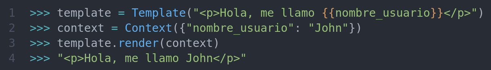

# :scroll: Xblock Prueba <!-- omit in toc -->

Guía para comprender como hacer uso de funciones para obtener datos de los usuarios y cursos de la plataforma **OpenEDX**.

## :clipboard: Contenido <!-- omit in toc -->

- [1. Entorno de Trabajo](#1-entorno-de-trabajo)
  - [1.1. Requisitos](#11-requisitos)
  - [1.2  Configuración de la Plataforma](#12--configuración-de-la-plataforma)
  - [1.3. Configuración del Entorno](#13-configuración-del-entorno)
- [2. Funcionamiento del XBlock](#2-funcionamiento-del-xblock)
  - [2.1. Adquisición de datos](#21-adquisición-de-datos)
  - [2.2. Renderizar Vistas](#22-renderizar-vistas)
- [3. Instalación del XBlock](#3-instalación-del-xblock)
  - [3.1. Instalación en el XBlock SDK](#31-instalación-en-el-xblock-sdk)
  - [3.2 Instalación en la plataforma de OpenEDX](#32-instalación-en-la-plataforma-de-openedx)

## 1. Entorno de Trabajo

Para modificar este XBlock o instalarlo es necesario tener instalados los requisitos y configurar el entorno de trabajo. Si desean saber como construir un XBlock desde cero, los invito a ver [esta pequeña guía](https://github.com/J4ckDev/MyXblock).

Para realizar las pruebas de instalación del XBlock es necesario tener una versión de la plataforma de **OpenEDX**, en mi caso haré uso de la versión **Ficus**.

### 1.1. Requisitos

Es importante contar con una versión de Ubuntu o Debian, contar con **Python 3.5 o mayor** e instalar las siguientes librerías y programas mediante el *terminal*:

| Librería o Programa                              | Comando de Instalación               |
| :------------------------------------- | :----------------------------------- |
| GNOME XML library                      | `sudo apt-get install libxml2-dev`   |
| XSLT 1.0 processing library            | `sudo apt-get install libxslt-dev`   |
| Compression library 32-bit development | `sudo apt-get install lib32z1-dev`   |
| IJG JPEG library                       | `sudo apt-get install libjpeg62-dev` |
|Curl|`sudo apt-get install curl`|
| Virtualenv                             | `pip install virtualenv`             |
|VirtualBox|`sudo apt-get install virtualbox`|
|Vagrant|Descargar [Vagrant](https://www.vagrantup.com/downloads), descomprimir el archivo zip y ejecutar el comando `sudo dpkg -i ARCHIVO_DESCOMPRIMIDO.deb`, en mi caso fué `sudo dpkg -i vagrant_2.2.10_x86_64.deb`. Se puede verificar la instalación correcta mediante el comando `vagrant version`.|

### 1.2  Configuración de la Plataforma


### 1.3. Configuración del Entorno

Con las librerias necesarias instaladas y la plataforma configurada, es momento de configurar el entorno de trabajo de la siguiente forma:

1. Dentro la carpeta que contiene a la máquina virtual, en mi caso fue *fullstack*, crear una carpeta con el nombre que deseen, en mi caso la creé con el nombre de *midirectorio* con el comando `mkdir midirectorio`.
2. Ingresar a la carpeta creada y ejecutar el comando `virtualenv venv`.
3. Iniciar el entorno virtual con el comando `source venv/bin/activate`. En mi caso luego de ejecutar el comando, en el terminal me apareció `(venv) jackdev@J4ckDev:~/midirectorio$`, el `(venv)` me indica que estoy trabajando en mi entorno virtual.
4. Obtener el XBlock SDK mediante el comando `git clone https://github.com/edx/xblock-sdk`.
5. Abrir la carpeta del proyecto clonado con `cd xblock-sdk` y ejecutar el comando `pip install -r requirements/base.txt` 
6. Escribir el comando `mkdir ./var` y por último escribir el comando `make install`, este último comando se encargará de instalar todos los módulos, librerías y dependencias requeridas por el SDK. Este comando a su vez permite ver todos los XBlock instalados cuando se corra el servidor. 
7. Realizar la migración de la base de datos con el comando `python manage.py migrate`.
8. Por último, si desea ejecutar el servidor del SDK hacerlo con `python manage.py runserver`.


## 2. Funcionamiento del XBlock

El XBlock sigue teniendo la funcionalidad por defecto que crea el *XBlock SDK*, que consiste en incrementar un contador al darle click a una etiqueta `p`. Como el fin de este XBlock es el de realizar pruebas para comprender como se pueden obtener datos de la plataforma *OpenEDX*, a continuación se irán presentando los datos que se logren consultar tanto usando el *XBlock SDK* y la plataforma de *OpenEDX*.

### 2.1. Adquisición de datos

Para obtener los datos del XBlock SDK o de la plataforma de OpenEDX, es importante definir cualquiera de las líneas de código que se presentarán en la siguiente tabla dentro el archivo Python del XBlock, en mi caso dentro `prueba.py`, igualarlas a una variable para poder ser usadas y [renderizar las vistas](#22-renderizar-vistas) si se desean mostrar a un usuario.

| Dato | Descripción | Linea de código para obtener su valor|
|:------|:------|:------|
|ID de Usuario|Es la variable que contiene la información del usuario, puede ser el identificador de un estudiante, de un profesor o un administrador.|`self.runtime.user_id`|
|ID del Curso|Es la variable que contiene el identificador del curso actual donde se encuentra el XBlock. **Esta variable solo funciona en la plataforma de OpenEDX, en el XBlock SDK se obtiene un error.**|`self.runtime.course_id`|


### 2.2. Renderizar Vistas

Sí luego de adquirir los datos en la plataforma de OpenEDX y se van a utilizar en cualquiera de las vistas de un XBlock, es necesario realizar los siguientes pasos:

1. Importar las siguientes librerías:  

| Librería | Descripción |
| :------ | :------ |
  | Template | En Django esta clase es la encargada de compilar el código plantilla que reciba, normalmente son fragmentos HTML que incluyen propiedades que deben ser procesadas y compiladas. Un ejemplo de los fragmentos que compila es el siguiente `<p>Hola, me llamo {{nombre_usuario}}</p>`.  |
  | Context | Esta clase de Django, es la encargada de procesar las plantillas compiladas por la clase Template y mapear la información contenida en un diccionario, luego usando `Template.render(context)` se renderiza todo para generar una vista estática. Siguiendo el ejemplo anterior sería algo así: |
  | Fragment | Es la librería que nos permite controlar todos los archivos asociados a la vista de un XBlock y mostrarlo en la página web, este incluye el contenido HTML, CSS y Javascript.|
  |pkg_resources|El módulo pkg_resources, distribuido con setuptools, proporciona una API para que las bibliotecas de Python accedan a sus archivos de recursos y las aplicaciones extensibles o frameworks descubran los plugins haciendo uso del formato egg. En este caso concreto los XBlock al ser mini aplicaciones web, hacen uso de esta librería para que puedan ser instaladas e integradas en el XBlock SDK o la plataforma OpenEDX. Normalmente esta librería se adiciona por defecto al crear un XBlock.

  El fragmento de código resultante para importar estas librerías es el siguiente:

  ```python
  import pkg_resources
  from xblock.fragment import Fragment
  from django.template import Context, Template
  ```

2. Declarar la variable o variables en el archivo python del XBlock que contendrán los diferentes datos que se van a presentar en la vista del XBlock luego de ser renderizada. En mi caso el archivo es `prueba.py` y se agregó la variable `title`, que contendrá el título por defecto del XBlock. A continuación se presenta el fragmento de código donde se muestra la forma en la que se importa el tipo de dato y la declaración de la variable.  
 ```python
 from xblock.fields import Integer, Scope, String

 ...

 title = String(
          default = "Prueba",
          scope = Scope.content,
          help = "XBlock Title",
        )
 ```  
 Se puede encontrar más información sobre los tipos de variables o *fields* y sobre el alcance o *scope* [aquí](https://edx.readthedocs.io/projects/xblock-tutorial/en/latest/concepts/fields.html).

3. Crear las funciones que se encargarán de la renderización de la vista del XBlock o los fragmentos de código HTML.
   
   - **Función load_resource:** Esta función será la encargada de obtener el archivo que contiene la vista del XBlock o el fragmento de código HTML para compilarlo. La función se puede ver a continuación:  
   ```python
   def load_resource(self, resource_path):
        """
        Gets the content of a resource
        """
        resource_content = pkg_resources.resource_string(__name__, resource_path)
        return resource_content.decode("utf8")
   ```

   - **Función render_template:** Esta función se encargará de hacer uso de *load_resource* para obtener la plantilla compilada y con el diccionario de datos que reciba, realizará la renderización de la vista o fragmento HTML a mostrar. La función se puede ver a continuación:
   ```python
   def render_template(self, template_path, context={}):
        """
        Evaluate a template by resource path, applying the provided context
        """
        template_str = self.load_resource(template_path)
        return Template(template_str).render(Context(context))
   ```
4. Hacer uso de las funciones en la vista del estudiante (buscar o crear la función `def student_view(self, context=None):`) y/o del profesor (buscar o crear la función `def studio_view(self, context=None):`), en mi caso haré uso de las funciones de renderizado en la vista del estudiante para mostrar el nombre del XBlock y el ID del usuario. A continuación se muestra un ejemplo con la plantilla HTML para la vista del estudiante y la función de Python que procesa dicha vista respectivamente:

 ```html
 <div class="prueba_block">
    <h2>Hola soy el usuario {{ user_id }} y este es el XBlock {{ title }}</h2>
  <p>
    PruebaXBlock: count is now <span class="count">{self.count}</span> (click me
    to increment).
  </p>
</div>
 ```

 ```python
 def student_view(self, context=None):
        """
        The primary view of the PruebaXBlock, shown to students
        when viewing courses.
        """
        data={
            'title': self.title,
            'user_id': self.runtime.user_id,
        }
        
        html = self.render_template("static/html/prueba.html", data)
        frag = Fragment(html.format(self=self))
        frag.add_css(self.resource_string("static/css/prueba.css"))
        frag.add_javascript(self.resource_string("static/js/src/prueba.js"))
        frag.initialize_js('PruebaXBlock')
        return frag
 ```
## 3. Instalación del XBlock

### 3.1. Instalación en el XBlock SDK

### 3.2 Instalación en la plataforma de OpenEDX