# :scroll: Xblock Prueba <!-- omit in toc -->

Guía para comprender como hacer uso de funciones para obtener datos de los usuarios y cursos de la plataforma **OpenEDX**.

## :clipboard: Contenido <!-- omit in toc -->

- [1. Entorno de Trabajo](#1-entorno-de-trabajo)
  - [1.1. Requisitos](#11-requisitos)
  - [1.2.  Configuración de la Plataforma](#12--configuración-de-la-plataforma)
  - [1.3. Configuración del Entorno](#13-configuración-del-entorno)
- [2. Funcionamiento del XBlock](#2-funcionamiento-del-xblock)
  - [2.1. Adquisición de datos](#21-adquisición-de-datos)
  - [2.2. Renderizar Vistas](#22-renderizar-vistas)
- [3. Instalación del XBlock](#3-instalación-del-xblock)
  - [3.1. Instalación en el XBlock SDK](#31-instalación-en-el-xblock-sdk)
  - [3.2. Instalación en la plataforma de OpenEDX](#32-instalación-en-la-plataforma-de-openedx)

## 1. Entorno de Trabajo

Para modificar y/o instalar este XBlock es necesario tener instalados los requisitos, configurar el entorno de trabajo y haber visto [esta pequeña guía](https://github.com/J4ckDev/MyXblock) donde explico algunas cosas básicas de como crear un Xblock desde cero.

Para realizar las pruebas de instalación del XBlock es necesario tener una versión de la plataforma de **OpenEDX**, en mi caso haré uso de la versión **Ficus**.

### 1.1. Requisitos

Es importante contar con una versión de Ubuntu o Debian, contar con **Python 3.5 o mayor** e instalar las siguientes librerías y programas mediante el *terminal*:  
| Librería o Programa                              | Comando de Instalación               |
| :------------------------------------- | :----------------------------------- |
| GNOME XML library                      | `sudo apt-get install libxml2-dev`   |
| XSLT 1.0 processing library            | `sudo apt-get install libxslt-dev`   |
| Compression library 32-bit development | `sudo apt-get install lib32z1-dev`   |
| IJG JPEG library                       | `sudo apt-get install libjpeg62-dev` |
|Curl|`sudo apt-get install curl`|
| Virtualenv                             | `pip install virtualenv`             |
|VirtualBox|`sudo apt-get install virtualbox`|
|Vagrant|Descargar [Vagrant](https://www.vagrantup.com/downloads), descomprimir el archivo zip y ejecutar el comando `sudo dpkg -i ARCHIVO_DESCOMPRIMIDO.deb`, en mi caso fué `sudo dpkg -i vagrant_2.2.10_x86_64.deb`. Se puede verificar la instalación correcta mediante el comando `vagrant version`.|

### 1.2.  Configuración de la Plataforma

Con *curl, virtualbox* y *vagrant* instalados, se puede realizar la instalación y configuración de la plataforma. La versión **Ficus** fue la usada por mí y los pasos para instalarla y configurarla son los siguientes:

1. Crear una carpeta con `mkdir` que contendrá la máquina virtual de la plataforma e ingresar en ella, en mi caso se llamó **fullstack** y con el comando `cd fullstack` ingresé en ella. 
2. Dentro la carpeta se escribe el comando `export OPENEDX_RELEASE="open-release/ficus.4` para crear una variable de entorno y luego se ejecuta el comando `wget
https://raw.github.com/edx/configuration/$OPENEDX_RELEASE/util/install/install_stack.sh` para obtener el script de instalación.
3. Con el script de instalación listo, se procede a darle privilegios de administrador con el comando `sudo chmod 755 install_stack.sh` y se ejecuta el comando `./install_stack.sh fullstack` para comenzar la instalación, se eligió el modo `fullstack` porque nuestro interés es el de imitar el entorno de producción.
4. Al finalizar la instalación, la máquina virtual se prende automáticamente y se puede comprobar que todo funciona correctamente abriendo la dirección `192.168.33.10` en cualquier navegador. Si todo está bien, se debe obtener cualquiera de las siguientes vistas:  

    <div align="center">

    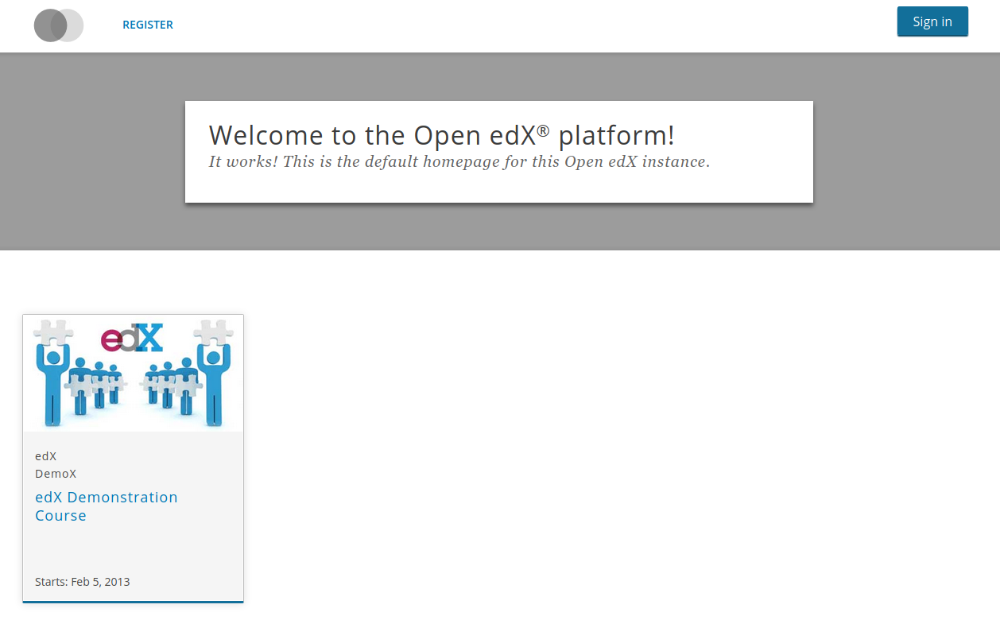

    Esta vista es cuando carga rápidamente el servicio de EDX y muestra correctamente el LMS.  

    </div>

    <div align="center">

    

    Esta vista aparece cuando EDX aún está cargando el LMS, pero actualizando el navegador se puede obtener la vista anterior.
    </div>

5. Luego de confirmar que todo funciona, se regresa al terminal para apagar la máquina virtual con el comando `sudo vagrant halt`, cuando esté apagada se ejecuta el comando `sudo gedit Vagrantfile`, se busca la línea de código `config.vm.synced_folder` y el valor **true** se pasa a **false**.  

    <div align="center">

    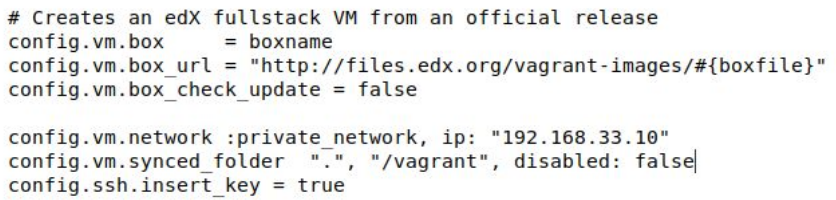

    </div>  

    Adicionalmente si se desea aumentar o disminuir la cantidad de RAM asignada a la máquina virtual, se busca la línea **MEMORY** que por defecto tiene asignadas 6GB de RAM, en mi caso la bajé al mínimo recomendado de 4GB porque mi computador solo tiene 8GB de RAM y con el valor por defecto se me bloqueaba mucho. 

    <div align="center">

    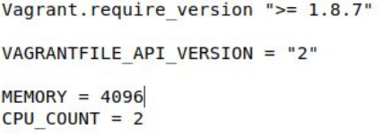

    </div>

6. Luego de guardar las modificaciones anteriores, se vuelve a prender la máquina virtual con `sudo vagrant up`, se ejecuta el comando `sudo vagrant ssh` y accederemos a la máquina virtual de la plataforma, cuando entremos por ssh aparecerá en consola `vagrant@vagrant:~$`, en ese momento ejecutamos el comando `sudo apt install python-paver`.
   
7. Cuando termina la instalación, se ejecutan los comandos `sudo su edxapp paver devstack studio` y `sudo su edxapp paver devstack lms`, con ello se inician los servicios de Studio (parte de la plataforma donde se administran los cursos de la plataforma) y LMS (parte de la plataforma donde los estudiantes ingresan para ver los cursos) respectivamente. 
   
8. Ahora se procede a crear el superusuario para controlar toda la plataforma de OpenEDX, para esto se ejecuta el siguiente conjunto de comandos:  
    ```bash
    sudo su edxapp -s /bin/bash
    cd ~
    source edxapp_env
    python /edx/app/edxapp/edx-platform/manage.py lms createsuperuser --settings aws
    ```  
    Esto pedirá un **Nombre de usuario, un correo y una contraseña**, colocar información que sea fácil de recordar.

    <div align="center">

    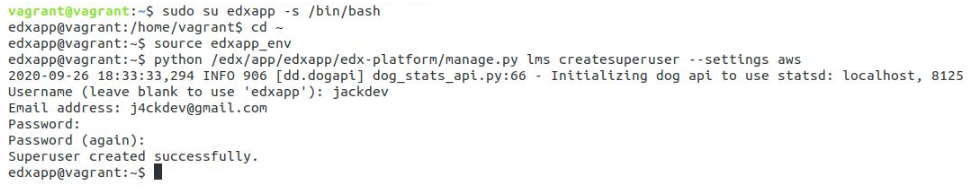

    </div>

9. Por último, ir a la dirección `192.168.33.10:18010` e iniciar sesión en Studio para comprobar que todo fue realizado correctamente, luego verá una interfaz similar a la siguiente:

    <div align="center">

    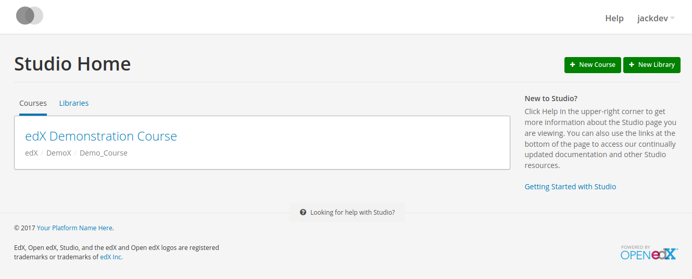

    </div>

### 1.3. Configuración del Entorno

Con las librerías necesarias instaladas y la plataforma configurada, es momento de configurar el entorno de trabajo de la siguiente forma:

1. Dentro la carpeta que contiene a la máquina virtual, en mi caso fue *fullstack*, crear una carpeta con el nombre que deseen, en mi caso la creé con el nombre de *midirectorio* con el comando `mkdir midirectorio`.
2. Ingresar a la carpeta creada y ejecutar el comando `virtualenv venv`.
3. Iniciar el entorno virtual con el comando `source venv/bin/activate`. En mi caso luego de ejecutar el comando, en el terminal me apareció `(venv) jackdev@J4ckDev:~/midirectorio$`, el `(venv)` me indica que estoy trabajando en mi entorno virtual.
4. Obtener el XBlock SDK mediante el comando `git clone https://github.com/edx/xblock-sdk`.
5. Abrir la carpeta del proyecto clonado con `cd xblock-sdk` y ejecutar el comando `pip install -r requirements/base.txt` 
6. Escribir el comando `mkdir ./var` y escribir el comando `make install`, este último comando se encargará de instalar todos los módulos, librerías y dependencias requeridas por el SDK. Este comando a su vez permite ver todos los XBlock instalados cuando se corra el servidor. 
7. Realizar la migración de la base de datos con el comando `python manage.py migrate`.
8. Ejecutar el servidor del SDK con `python manage.py runserver` y dirigirse a la dirección `127.0.0.1:8000` para ver todos los XBlock instalados en el SDK.

    <div align="center">

    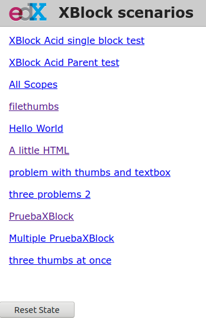

    </div>

9. Regresar al terminal y apagar el servidor con la combinación de teclas **Ctrl+c** y ejecutar el comando `python manage.py createsuperuser`, con esto se solicitará un **nombre de usuario, una dirección de correo y una contraseña** que serán las credenciales para ingresar al sistema de administración del XBlock SDK para poder modificar estados de los XBlock instalados, crear grupos y nuevos usuarios.

    <div align="center">

    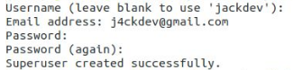

    </div>

10. Por último se ejecuta de nuevo el servidor con el comando `python manage.py runserver` y se accede a la dirección `127.0.0.1:8000/admin` para iniciar sesión con las credenciales recién creadas, verá la siguiente interfaz administrativa:

    <div align="center">

    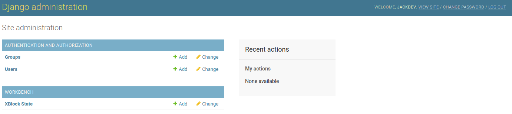

    </div>

## 2. Funcionamiento del XBlock

El XBlock sigue teniendo la funcionalidad por defecto que crea el *XBlock SDK*, que consiste en incrementar un contador al darle click a una etiqueta `<p>`. Como el fin de este XBlock es el de realizar pruebas para comprender como se pueden obtener datos de la plataforma *OpenEDX*, a continuación se irán presentando los datos que se logren consultar tanto usando el *XBlock SDK* y la plataforma de *OpenEDX*.

### 2.1. Adquisición de datos

Para obtener los datos del XBlock SDK o de la plataforma de OpenEDX, es importante definir cualquiera de las líneas de código que se presentarán en la siguiente tabla dentro el archivo Python del XBlock, en mi caso dentro `prueba.py`, igualarlas a una variable para poder ser usadas y [renderizar las vistas](#22-renderizar-vistas) si se desean mostrar a un usuario.

  | Dato | Descripción | Linea de código para obtener su valor|
  |:------|:------|:------|
  |ID de Usuario|Es la variable que contiene la información del usuario, puede ser el identificador de un estudiante, de un profesor o un administrador.|`self.runtime.user_id`|
  |ID del Curso|Es la variable que contiene el identificador del curso actual donde se encuentra el XBlock. **Esta variable solo funciona en la plataforma de OpenEDX, en el XBlock SDK se obtiene un error.**|`self.runtime.course_id`|

### 2.2. Renderizar Vistas

Sí los datos adquiridos en la plataforma de OpenEDX se van a utilizar en cualquiera de las vistas de un XBlock, es necesario realizar los siguientes pasos:

1. Importar las siguientes librerías:  

    | Librería | Descripción |
    | :------ | :------ |
    | Template | En Django esta clase es la encargada de compilar el código plantilla que reciba, normalmente son fragmentos HTML que incluyen propiedades que deben ser procesadas y compiladas. Un ejemplo de los fragmentos que compila es el siguiente `<p>Hola, me llamo {{nombre_usuario}}</p>`.  |
    | Context | Esta clase de Django, es la encargada de procesar las plantillas compiladas por la clase Template y mapear la información contenida en un diccionario, luego usando `Template.render(context)` se renderiza todo para generar una vista estática. Siguiendo el ejemplo anterior sería algo así:|
    | Fragment | Es la librería que nos permite controlar todos los archivos asociados a la vista de un XBlock y mostrarlo en la página web, este incluye el contenido HTML, CSS y Javascript.|
    |pkg_resources|El módulo pkg_resources, distribuido con setuptools, proporciona una API para que las bibliotecas de Python accedan a sus archivos de recursos y las aplicaciones extensibles o frameworks descubran los plugins haciendo uso del formato egg. En este caso concreto los XBlock al ser mini aplicaciones web, hacen uso de esta librería para que puedan ser instaladas e integradas en el XBlock SDK o la plataforma OpenEDX. Normalmente esta librería se adiciona por defecto al crear un XBlock.|

    El fragmento de código resultante para importar estas librerías es el siguiente:

    ```python
    import pkg_resources
    from xblock.fragment import Fragment
    from django.template import Context, Template
    ```

2. Declarar el field o los fields en el archivo python del XBlock que almacenarán la información a presentar en la vista del XBlock luego de ser renderizada. En mi caso el archivo es `prueba.py` y se agregó la variable `title`, que contendrá el título por defecto del XBlock y tendrá el alcance de contenido. A continuación se presenta el fragmento de código donde se muestra la forma en la que se importa el tipo de dato y la declaración del field.  

    ```python
    from xblock.fields import Integer, Scope, String

    ...

    title = String(
        default = "Prueba",
        scope = Scope.content,
        help = "XBlock Title",
    )
    ```  

    Se puede encontrar más información sobre los camposs o *fields* y  el alcance o *scope* **[aquí](https://github.com/J4ckDev/MyXblock#32-construcci%C3%B3n-del-xblock)**.

3. Crear las funciones que se encargarán de la renderización de la vista del XBlock o los fragmentos de código HTML.
   
   - **Función load_resource:** Esta función será la encargada de obtener el archivo que contiene la vista del XBlock o el fragmento de código HTML para compilarlo. La función se puede ver a continuación:  
      
      ```python
      def load_resource(self, resource_path):
          """
          Gets the content of a resource
          """
          resource_content = pkg_resources.resource_string(__name__, resource_path)
          return resource_content.decode("utf8")
      ```

   - **Función render_template:** Esta función se encargará de hacer uso de *load_resource* para obtener la plantilla compilada y con el diccionario de datos que reciba, realizará la renderización de la vista o fragmento HTML a mostrar. La función se puede ver a continuación:
      
      ```python
      def render_template(self, template_path, context={}):
          """
          Evaluate a template by resource path, applying the provided context
          """
          template_str = self.load_resource(template_path)
          return Template(template_str).render(Context(context))
      ```

4. Hacer uso de las funciones en la vista del estudiante (buscar o crear la función `def student_view(self, context=None):`) y/o del profesor (buscar o crear la función `def studio_view(self, context=None):`), en mi caso haré uso de las funciones de renderizado en la vista del estudiante para mostrar el nombre del XBlock y el ID del usuario. A continuación se muestra un ejemplo con la plantilla HTML para la vista del estudiante y la función de Python que procesa dicha vista respectivamente:  
    
    ```html
    <div class="prueba_block">
        <h2>Hola soy el usuario {{ user_id }} y este es el XBlock {{ title }}</h2>
      <p>
        PruebaXBlock: count is now <span class="count">{self.count}</span> (click me to increment).
      </p>
    </div>
    ``` 

    ```python
    def student_view(self, context=None):
            """
            The primary view of the PruebaXBlock, shown to students when viewing courses.
            """
            data={
                'title': self.title,
                'user_id': self.runtime.user_id,
            }
        
            html = self.render_template("static/html/prueba.html", data)
            frag = Fragment(html.format(self=self))
            frag.add_css(self.resource_string("static/css/prueba.css"))
            frag.add_javascript(self.resource_string("static/js/src/prueba.js"))
            frag.initialize_js('PruebaXBlock')
            return frag
      ```
## 3. Instalación del XBlock

### 3.1. Instalación en el XBlock SDK

Para instalar el XBlock es necesario tener el entorno virtual activado y estar una carpeta anterior a la carpeta del XBlock, en mi caso dentro la carpeta *midirectorio* tengo el siguiente árbol de carpetas:

<div align="center">

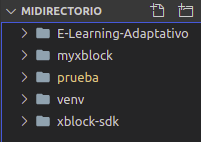

</div>

Por lo que en el terminal se ejecuta el comando `pip install -e prueba` dentro la carpeta `midirectorio` y se obtendrá algo parecido a lo siguiente:

```bash
(venv) jackdev@J4ckDev:~/midirectorio$ pip install -e prueba
    Obtaining file:///home/jackdev/Documentos/fullstack/midirectorio/prueba
    Requirement already satisfied: XBlock in ./venv/lib/python3.6/site-packages (from prueba-xblock==0.1) (1.3.1)
    ...
    Requirement already satisfied: setuptools in ./venv/lib/python3.6/site-packages (from fs->XBlock->prueba-xblock==0.1) (45.2.0)
    Installing collected packages: prueba-xblock
    Running setup.py develop for prueba-xblock
    Successfully installed prueba-xblock
```
Con esto listo, se enciende el servidor ejecutando el comando `python manage.py runserver` dentro la carpeta `xblock-sdk` y se debería observar el XBlock correctamente instalado.  
**Nota:** Como la última versión de este XBlock hace uso de la variable `course_id`, se obtendrá el siguiente error:

<div align="center">


</div>

Para solucionar esto, solo debe eliminar esta [la línea 58 del archivo prueba.py](https://github.com/J4ckDev/XBlockPrueba/blob/main/prueba/prueba.py#L58) y elimine [la línea 3 del HTML](https://github.com/J4ckDev/XBlockPrueba/blob/main/prueba/static/html/prueba.html#L3), al actualizar la página obtendrá el siguiente resultado:

<div align="center">

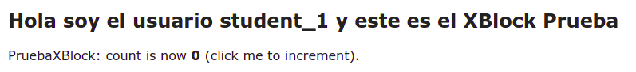

</div>

Sí desea comprobar que detecta los ID de usuario correctamente, puede agregar al final de la URL el valor `?student=1`, en mi caso la URL quedó `http://127.0.0.1:8000/scenario/prueba.0/?student=1`, actualice la página y obtendrá lo siguiente:

<div align="center">

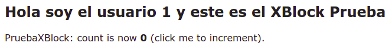

</div>

Sí desea desinstalar un XBlock, solo debe ejecutar dentro el entorno virtual el comando `pip uninstall nombre-xblock`, donde *nombre-xblock* se puede encontrar en el archivo `setup.py`; en el caso concreto que desee eliminar este XBlock puede encontrar el nombre como [`name='prueba-xblock'`](https://github.com/J4ckDev/XBlockPrueba/blob/main/setup.py#L27), por lo que el comando sería `pip uninstall prueba-xblock`.

### 3.2. Instalación en la plataforma de OpenEDX

Es necesario tener encendido la *máquina virtual de OpenEDX* y estar conectado a el por SSH, sino lo está debe dirigirse a la carpeta donde tiene el `Vagrantfile`, en mi caso se llama `fullstack`, luego abrir una consola y ejecutar los comandos `sudo vagrant up` y `sudo vagrant ssh`. Si todo está correcto, debería aparecer en el terminal `vagrant@vagrant:~$` y se puede iniciar la instalación de la última versión del Xblock *prueba*, siguiendo los siguientes pasos:

1. Ejecutar el comando `sudo -u edxapp /edx/bin/pip.edxapp install /vagrant/midirectorio/prueba`, en caso de haber usado un nombre diferente a la carpeta `midirectorio` o si vas a instalar otro XBlock, solo cambia los nombres que correspondan a las carpetas. 
Al finalizar la instalación se debe obtener lo siguiente:

    <div align="center">

    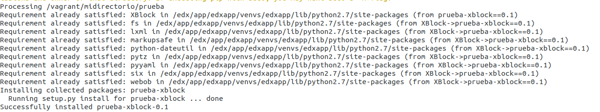

    </div>

2. Instalar todas las librerías que haya instalado en el entorno virtual para adicionar funcionalidades al XBlock de esta guía, uno que esté desarrollando o para hacer funcionar otro XBlock que haya descargado, es muy probable que **no estén disponibles en OpenEDX**, por lo que recomiendo que se cerciore de que estén disponibles instalando las librerías en la plataforma con `pip install`. Para el caso concreto del Xblock desarrollado en esta guía, no es necesario instalar nada adicional.  
3. Hecho lo anterior, ejecute los siguientes comandos para configurar la plataforma e indexe el nuevo Xblock instalado:

    ```bash
    sudo -H -u edxapp bash
    source /edx/app/edxapp/edxapp_env
    cd /edx/app/edxapp/edx-platform
    paver update_assets cms --settings=aws
    paver update_assets lms --settings=aws
    ```

    Al final si la compilación fue correcta, se obtendrá el siguiente mensaje:

    <div align="center">

    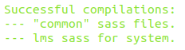

    </div>

4. Luego se sale del bash de la OpenEDX con `exit` y se ejecutan los comandos `sudo /edx/bin/supervisorctl restart edxapp:` y `sudo /edx/bin/supervisorctl restart edxapp_worker:` para reinicar los servicios de toda la plataforma.

    <div align="center">

    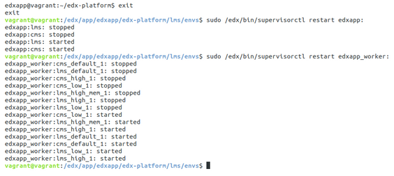

    </div>

5. Abrir el navegador y colocar `http://192.168.33.10:18010/` para abrir Studio, luego inicia sesión con las credenciales creadas en el paso 8 de la [sección 1.2](#12--configuración-de-la-plataforma), abre el curso de demostración, dirígete a *settings > Advanced Settings* y agrega el módulo *prueba*, así adicionas el XBlock al curso.
   
    <div align="center">

    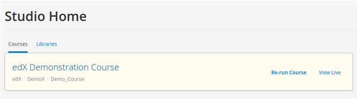
    </div>

    <div align="center">

    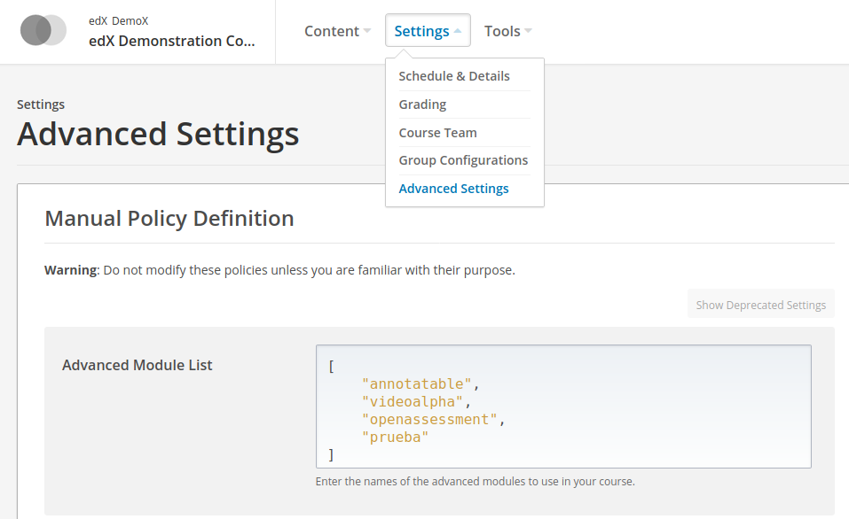

    </div>  

6. Ahora se regresa al contenido del curso, abrir el video introductorio, dirigirse al final de la página para dar click en *Advanced*, seleccionar el XBlock prueba y será adicionado debajo del video.
   
    <div align="center">

    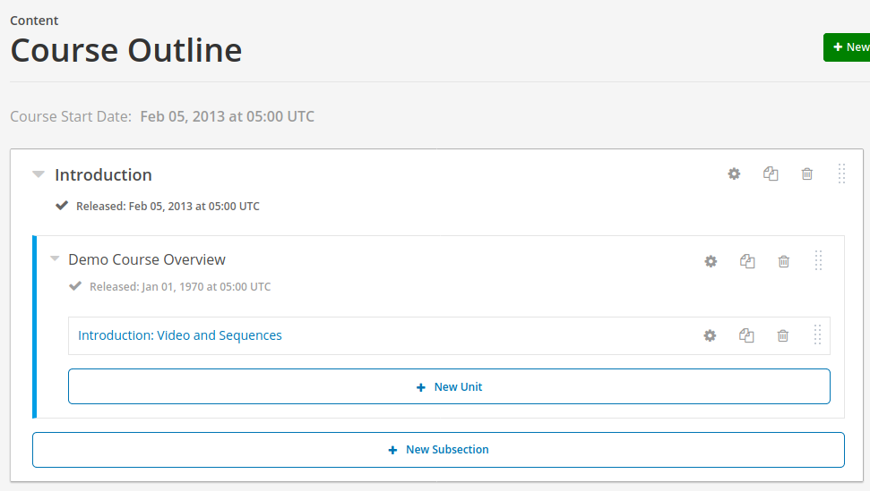

    </div>

    <div align="center">

    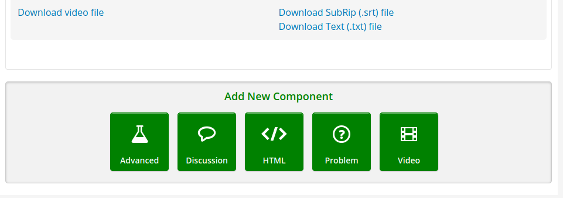

    </div>

    <div align="center">

    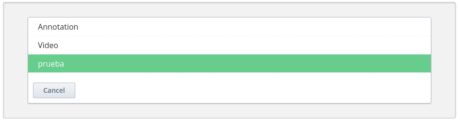

    </div>

    <div align="center">

    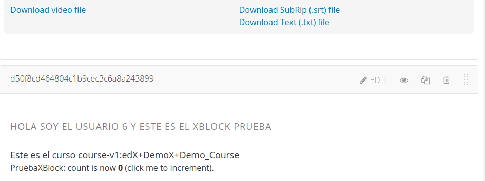

    </div>

7. Por último, se guardan los cambios para que aparezcan en el LMS, dando click en *Publish* en la parte superior derecha de la página.

    <div align="center">

    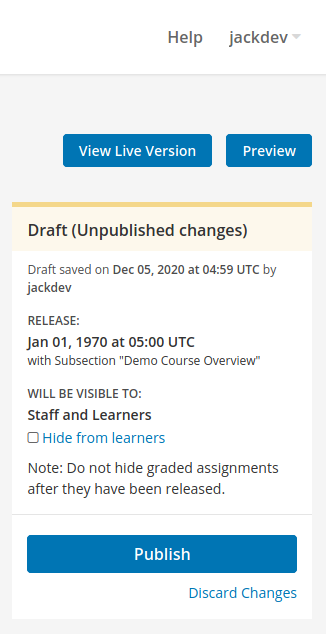
    
    </div>

Adicionalmente en caso de que desee desinstalar el XBlock de la plataforma, asegurese de estar en el terminal como `vagrant@vagrant:~$` y ejecute el el comando `/edx/bin/pip.edxapp uninstall nombre-xblock`, donde *nombre-xblock* se puede encontrar en el archivo `setup.py`, si por algún motivo no dispone de este archivo puede ejecutar `/edx/bin/pip.edxapp list` y podrá observar todos los XBlock instalados en la plataforma para buscar el que desea desinstalar. El XBlock prueba se puede desinstalar con el comando `/edx/bin/pip.edxapp uninstall prueba-xblock`.